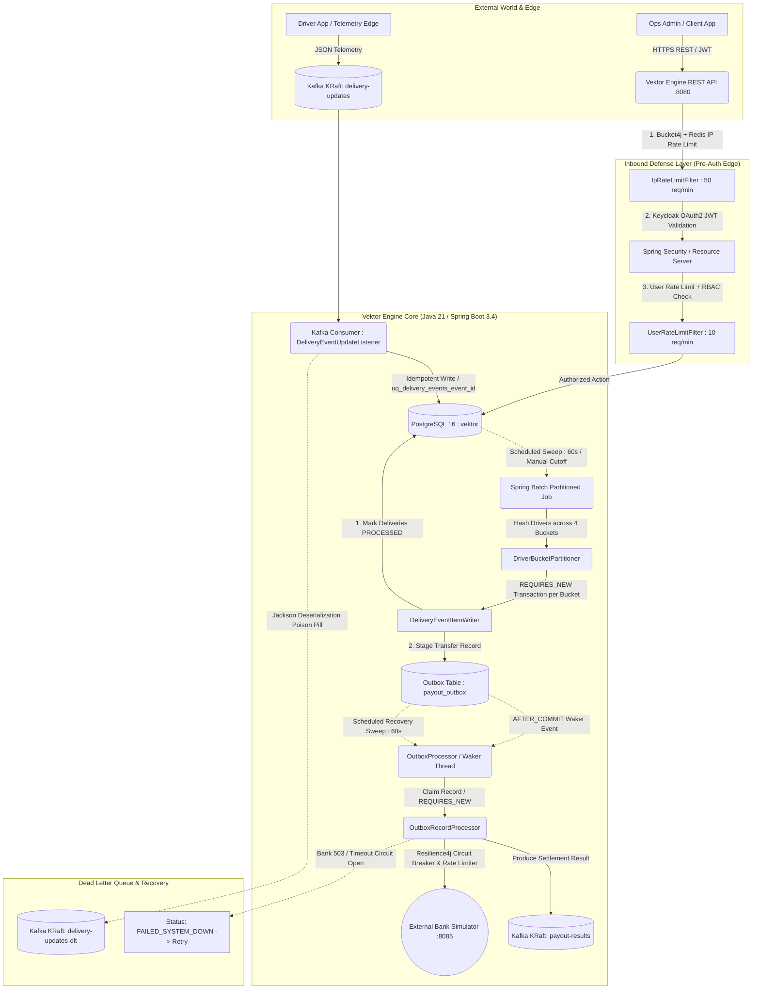

# 🚀 Vektor Dispatch & Payout Engine

[](https://openjdk.org/projects/jdk/21/)
[](https://spring.io/projects/spring-boot)
[](https://kafka.apache.org/)
[](https://www.postgresql.org/)
[](https://redis.io/)
[](https://www.keycloak.org/)
[](https://resilience4j.readme.io/)
[](https://grafana.com/)

A highly concurrent, fault-tolerant financial settlement engine designed for real-time logistics and gig-economy platforms.

The **Vektor Engine** safely ingests high-throughput delivery telemetry via **Apache Kafka (KRaft mode)**, computes dynamic driver payouts using partition-isolated **Spring Batch** processing, and dispatches funds to external banking rails with absolute, zero-data-loss consistency through the **Transactional Outbox & Waker Pattern**.

---

## 🏗️ Enterprise Architecture

This system implements multiple enterprise-grade high-availability design patterns to guarantee strict data integrity, idempotent ingestion, and accurate financial settlement—even during severe network partitions, downstream banking outages, Kafka broker disconnects, or sudden JVM crashes.



---

## 🧠 Core Engineering Patterns & Technical Decisions

This engine was built from the ground up to solve the hardest concurrency, consistency, and resilience challenges in distributed financial settlement systems:

### 1. Inbound Edge Protection (The "Embedded Edge" Pattern)
Instead of relying solely on external API gateways, Vektor implements defense-in-depth directly at the application boundary:
* **Pre-Auth Distributed IP Rate Limiting (`IpRateLimitFilter`)**: A **Bucket4j + Redis** distributed interceptor limits incoming raw IPs (`50 requests / minute / IP`) before hitting the application layer. This drops DDoS floods and unauthenticated spam before the CPU wastes cycles evaluating cryptographic tokens.
* **Authenticated User Rate Limiting (`UserRateLimitFilter`)**: Once authenticated, individual users are assigned dedicated token buckets (`10 requests / minute / user`) to prevent noisy-tenant exhaustion.
* **Stateless OAuth2 Security**: Spring Security acts as an OAuth2 Resource Server validating RS256 JWTs signed by an external **Keycloak OIDC** instance. Strict Role-Based Access Control (`payout_admin` vs. `payout_read`) is enforced on all sensitive REST endpoints.

### 2. Idempotent Data Ingestion & The Dead Letter Topic
Handling Kafka's *at-least-once* delivery semantics without risking duplicate calculations:
* **Database Idempotency**: The persistence layer enforces strict unique constraints (`uq_delivery_events_event_id`) on incoming UUIDs (`V1__create_delivery_events.sql`). If network retries cause a duplicate telemetry payload to arrive, the consumer catches `DataIntegrityViolationException` and skips the record without crashing or duplicating data.
* **Poison Pill Routing (`ErrorHandlingDeserializer`)**: Corrupt JSON payloads or type mismatches that fail Jackson deserialization are caught by a `DeadLetterPublishingRecoverer` configured with `ByteArraySerializer`. Raw malformed bytes are seamlessly routed to a Dead Letter Topic (`delivery-updates-dlt`) on the exact same partition for manual inspection, guaranteeing that the main consumer group never halts or blocks on bad data.

### 3. The Cutoff-Timestamp Invariant (Solving Double-Payments)
In a high-throughput logistics platform, delivery events arrive continuously every second while batch payout jobs are actively calculating driver totals. If a newly arriving delivery event is accidentally marked as `PROCESSED` by a running batch transaction but wasn't included in the `ItemReader` query math, the driver loses money.
* **The Mathematical Fix**: Vektor passes an immutable `cutoff_timestamp` (`Instant.now().minusSeconds(5)`) into the Spring Batch `JobParameters`. Both the `ItemReader` and `ItemWriter` strictly filter `received_at <= :cutoff`, guaranteeing atomic snapshot consistency between what was calculated and what is marked paid.

### 4. Partitioned Batch Processing & Mid-Chunk Crash Resilience
To scale payout calculations across thousands of active drivers, Vektor utilizes **Spring Batch Partitioning** (`DriverBucketPartitioner`):
* Active drivers are hashed deterministically into `4` isolated buckets (`${vektor.payout.partition-count:4}`). Each bucket is processed concurrently by a worker thread executing inside its own independent database transaction (`REQUIRES_NEW`).
* **Mid-Chunk Crash Resilience**: If the JVM encounters an `OutOfMemoryError` or power loss while processing Bucket #3, Buckets #1, #2, and #4 remain successfully committed in PostgreSQL. Upon application restart, Spring Batch metadata (`BATCH_STEP_EXECUTION`) detects the failure and instantly resumes processing **only the uncompleted Bucket #3**, completely preventing split-brain states or duplicate financial transfers.

### 5. The Transactional Outbox & Waker Pattern (Solving Dual-Writes)
When triggering a bank transfer, an application cannot atomically commit a local database transaction and execute an HTTP POST call to an external bank API in the same step. If the database commits but the network connection drops, or if the HTTP call succeeds and the database crashes before committing, the system suffers from catastrophic dual-write inconsistency.
* **The Fix (`PayoutOutbox`)**: Vektor uses the **Transactional Outbox Pattern**. Payout calculations, delivery status updates (`PROCESSED`), and outbound transfer intentions (`payout_outbox`) are persisted to PostgreSQL within a single ACID transaction (`V7__add_outbox.sql`).
* **The Sub-Second Waker (`@TransactionalEventListener`)**: To avoid the latency of waiting for a polling cron job, a Spring event listener bound to `TransactionPhase.AFTER_COMMIT` instantly wakes the `OutboxProcessor` thread the exact millisecond the transaction safely commits to disk.
* **Atomic Claiming (`outboxRepository.claim`)**: To prevent race conditions across horizontal application replicas, outbox records are claimed atomically via `UPDATE payout_outbox SET status = 'PROCESSING', claimed_at = :now WHERE outbox_id = :id AND status = 'PENDING'`.

### 6. Outbound Resilience (Circuit Breakers & Banking Rate Limiters)
External core banking APIs are notoriously unreliable and subject to rate limits. Vektor shields its outbound HTTP clients (`RestClient`) using **Resilience4j**:
* **Circuit Breaker (`bankGateway`)**: Continuously evaluates a sliding window of `5` calls. If `50%` or more return `503 Service Unavailable` or time out, the circuit opens for `15 seconds`. During an open circuit, outbox attempts fail fast with `FAILED_SYSTEM_DOWN` to preserve thread pool capacity.
* **Rate Limiter (`bankGateway`)**: Strictly regulates outbound calls to max `10 requests / second` (`limit-refresh-period: 1s`).
* **Automated Sweeper Recovery**: Outbox records marked `FAILED` or stuck in `PROCESSING` longer than `5 minutes` (`${vektor.outbox.stuck-threshold-minutes:5}`) are automatically harvested by a background cron sweeper (`scheduledSweep`) and retried using the exact original `Idempotency-Key` until the banking rail acknowledges settlement.

---

## 🛠️ Technology Stack

| Category | Technology | Version / Details | Purpose |
| :--- | :--- | :--- | :--- |
| **Language & Core** | Java, Spring Boot | JDK 21 LTS, Spring Boot 3.4.1 | Core application framework & modern virtual threads |
| **Streaming & Messaging** | Apache Kafka | Latest (KRaft Mode, No Zookeeper) | High-throughput telemetry ingestion & payout results |
| **Batch & Data** | Spring Batch, Spring Data JPA | Batch 5.x, Hibernate / JPA | Partitioned chunk processing & database persistence |
| **Database & Caching** | PostgreSQL, Redis | PostgreSQL 16, Redis 7 Alpine | Relational storage (Flyway migrations) & Bucket4j distributed rate limiting |
| **Security & IAM** | Spring Security, Keycloak | Keycloak 26.0 (OAuth2 / OIDC RS) | Stateless JWT validation & Role-Based Access Control |
| **Resilience** | Resilience4j | Circuit Breaker & Rate Limiter | Downstream fault tolerance for external bank APIs |
| **Observability** | PLG Stack, SLF4J MDC | Prometheus, Grafana, Loki, Promtail | Metrics scraping, structured log aggregation, and distributed tracing |
| **Testing** | JUnit 5, Testcontainers | Testcontainers 1.20.4, Awaitility | Ephemeral Docker chaos testing & integration proofs |

---

## 🚀 Getting Started (Quickstart)

### Prerequisites
* **Docker & Docker Compose** (v2+)
* **Java 21 & Maven 3.9+** *(Optional: only needed if building/running outside Docker)*

### 1. Boot the Entire Enterprise Infrastructure
A single command compiles the engine and launches the full stack—PostgreSQL 16, Kafka (KRaft), Redis 7, Keycloak 26, Prometheus, Grafana, Loki, Promtail, the Vektor Bank Simulator (`:8085`), and the Vektor Dispatch Engine (`:8080`).

```bash
# Optional local build check
./mvnw clean package -DskipTests

# Launch full infrastructure & application containers
docker-compose -f dispatch-engine/docker-compose.yml up -d --build
```

### 2. Verify Port Allocations & Services

Once booted (`docker ps`), the following endpoints are immediately active:

| Service | Local URL / Port | Credentials / Notes |
| :--- | :--- | :--- |
| **Vektor Dispatch Engine API** | `http://localhost:8080` | Main application REST API & Actuator endpoints |
| **OpenAPI / Swagger UI** | `http://localhost:8080/swagger-ui/index.html` | Interactive API Explorer & Schema documentation |
| **Keycloak IAM Admin** | `http://localhost:8081` | `admin` / `admin` (Pre-loaded realm: `vektor`) |
| **Bank Simulator API** | `http://localhost:8085` | External Bank API simulator with Chaos Monkey logic |
| **Grafana Dashboard** | `http://localhost:3000` | `admin` / `admin` (Pre-connected to Prometheus & Loki) |
| **Prometheus Metrics** | `http://localhost:9090` | Scrapes `http://vektor-engine:8080/actuator/prometheus` |
| **PostgreSQL Database** | `localhost:5433` (`5432` inside Docker) | User: `vektor` / Pass: `vektor` / DB: `vektor` |
| **Redis Cache** | `localhost:6379` | Bucket4j distributed token buckets |
| **Kafka Broker (KRaft)** | `localhost:9092` (`29092` inside Docker) | Topics: `delivery-updates`, `delivery-updates-dlt`, `payout-results` |

---

## 🔐 Security & Authentication Guide

Keycloak is pre-configured on startup with the `vektor-realm.json` import file (`dispatch-engine/keycloak/vektor-realm.json`). You do not need to manually create clients or users.

### Pre-Provisioned Accounts & Roles
* **Ops Admin (`ops-admin` / `admin123`)**: Has `payout_admin` and `payout_read` roles. Can trigger manual settlements and ingest test delivery events via REST.
* **Driver Portal (`driver-portal` / `portal123`)**: Has `payout_read` role only. Can query payout statements and unpaid delivery queues.

### Fetching a JWT Access Token via `curl`

```bash
# Get Admin JWT Token
export ADMIN_TOKEN=$(curl -s -X POST "http://localhost:8081/realms/vektor/protocol/openid-connect/token" \
  -H "Content-Type: application/x-www-form-urlencoded" \
  -d "grant_type=password" \
  -d "client_id=vektor-api" \
  -d "client_secret=vektor-api-secret" \
  -d "username=ops-admin" \
  -d "password=admin123" | jq -r '.access_token')

echo "Token: $ADMIN_TOKEN"
```

---

## 📡 API Reference & Curl Walkthrough

All API requests MUST include the `Authorization: Bearer <TOKEN>` header (or be tested via the Swagger UI at `http://localhost:8080/swagger-ui/index.html`).

### 1. Ingest Delivery Event (Admin Role Required)
Simulate ingesting a completed delivery directly via REST:

```bash
curl -X POST "http://localhost:8080/api/v1/deliveries/events" \
  -H "Authorization: Bearer $ADMIN_TOKEN" \
  -H "Content-Type: application/json" \
  -d '{
    "eventId": "a1b2c3d4-e5f6-7a8b-9c0d-1e2f3a4b5c6d",
    "driverId": "R-101",
    "status": "DELIVERED",
    "lat": 6.8118,
    "lng": 79.8659,
    "distanceKm": 4.50,
    "occurredAt": "2026-07-12T10:00:00Z"
  }'
```

### 2. Query Unpaid Delivery Queue (Read Role Required)
```bash
curl -X GET "http://localhost:8080/api/v1/deliveries/unpaid?page=0&size=10" \
  -H "Authorization: Bearer $ADMIN_TOKEN"
```

### 3. Trigger Manual Payout Settlement Sweep (Admin Role Required)
Triggers the partitioned Spring Batch payout job immediately (bypassing the 60s scheduler interval):

```bash
curl -X POST "http://localhost:8080/api/v1/payouts/trigger-settlement" \
  -H "Authorization: Bearer $ADMIN_TOKEN"
```

### 4. Query Driver Payout Statements (Read Role Required)
```bash
curl -X GET "http://localhost:8080/api/v1/payouts/R-101?page=0&size=10" \
  -H "Authorization: Bearer $ADMIN_TOKEN"
```

---

## 📬 Asynchronous Kafka Event Contracts

For detailed Kafka schema definitions and forward-compatibility rules, see **[`docs/EVENTS.md`](docs/EVENTS.md)**.

### Inbound Topic: `delivery-updates`
Producers publish driver GPS pings and completed deliveries formatted as JSON:
* **Message Key**: `driverId` (`String`) — Required to guarantee strict per-driver sequential ordering across Kafka partitions.
* **Schema**: `{ eventId (UUID), driverId (String), status (Enum: EN_ROUTE|DELIVERED|FAILED|CANCELLED), lat (Double), lng (Double), distanceKm (Double), occurredAt (ISO-8601) }`
* **Idempotency & Retries**: Consumers drop duplicate `eventId` records seamlessly. Corrupt messages trigger 3 retry attempts before being redirected to `delivery-updates-dlt`.

### Outbound Topic: `payout-results`
When the outbox processor successfully completes a bank transfer via the `BankGatewayService`, it emits a settlement notification:
* **Message Key**: `driverId` (`String`)
* **Payload (`PayoutCompletedEventPayload`)**:
```json
{
  "outboxId": "f81d4fae-7dec-11d0-a765-00a0c91e6bf6",
  "driverId": "R-101",
  "amount": 142.50,
  "bankReference": "BANK-REF-F81D4FAE",
  "status": "PAID",
  "processedAt": "2026-07-12T10:01:15.123Z"
}
```

---

## ⚡ Live Simulation & Chaos Engineering Demo

You can observe the Vektor Engine's self-healing capabilities live using the included Python driver telemetry simulator and the external Bank Simulator's "Chaos Monkey".

### 1. Launch the Live Telemetry Simulator (`mock_driver.py`)
Ensure Python 3+ and `kafka-python` (`pip install kafka-python`) are installed, then run:

```bash
python mile-delivery/mock_driver.py
```
* The script connects to `localhost:9092` and streams GPS coordinates (`EN_ROUTE`) every 2 seconds for `driverId = R-101`.
* **Every 10th ping**, it fires a `DELIVERED` event with a randomized `distanceKm` (between 1.2 and 8.5 km).
* **Every 15th ping**, it intentionally fires a **Poison Pill** (`{"driverId": "R-101", "broken_json": "missing_fields", "lat": "THIS_WILL_CRASH_JAVA"}`).

### 2. Watch the DLT & Circuit Breaker Trip in Real Time
1. Open terminal logs for the dispatch engine:
   ```bash
   docker logs -f vektor-engine
   ```
2. **Watch the Poison Pill Quarantine**: When the 15th iteration sends invalid JSON, notice that Jackson deserialization fails, but the engine immediately catches it and logs:
   `ErrorHandlingDeserializer: routing bad payload to delivery-updates-dlt`.
3. **Watch the Bank Chaos Monkey (`BankSimulatorController`)**:
   The `bank-simulator` container (`localhost:8085`) runs with embedded chaos injection:
   * `20% chance` of returning `503 Service Unavailable`.
   * `20% chance` of sleeping for `4000ms` (triggering timeouts).
   * `60% chance` of success (`BANK-REF-XXXX`).
4. When multiple `503` or timeout responses hit the `BankGatewayService`, watch Resilience4j **OPEN THE CIRCUIT BREAKER**. The outbox records transition to `FAILED_SYSTEM_DOWN`, saving threads. Exactly 60 seconds later, watch the background sweeper (`ScheduledSweep`) pick up the failed records and re-attempt the transfer using the exact original `Idempotency-Key` until the bank responds with success!

---

## 🔭 Observability & Distributed Tracing (PLG Stack)

The engine integrates a full observability architecture. **SLF4J MDC (Mapped Diagnostic Context)** is configured via `TraceIdFilter` to automatically inject `traceId` (or pass-through `X-Trace-ID` headers) and `driverId` into every log event.

Logs are serialized as structured JSON using `LogstashEncoder` and shipped via Docker socket through **Promtail** to **Grafana Loki**.

### Querying Logs in Grafana (`http://localhost:3000`)
Navigate to **Explore -> Loki** and use LogQL to trace exact lifecycles across components:

* **Trace a specific driver across Kafka consumption, Spring Batch, and Outbox dispatch:**
  ```logql
  {app="vektor-dispatch-engine"} |= "R-101"
  ```
* **Find all tripped circuit breakers or banking rail rate limits:**
  ```logql
  {app="vektor-dispatch-engine"} |= "Downstream Banking Rail"
  ```
* **Filter by a specific end-to-end distributed trace ID:**
  ```logql
  {app="vektor-dispatch-engine"} | json | traceId="0190a6e8-7c8a-7d23-b123-456789abcdef"
  ```

### Monitoring Prometheus Metrics (`http://localhost:9090`)
Prometheus automatically scrapes JVM, Spring Batch, Kafka Consumer, and Resilience4j metrics from `http://vektor-engine:8080/actuator/prometheus`. You can build custom dashboards around:
* `resilience4j_circuitbreaker_state{name="bankGateway"}`
* `spring_batch_job_execution_seconds_bucket`
* `bucket4j_summary_consumed_tokens`

---

## 🧪 Automated Integration & Chaos Test Suites

The integration test suite utilizes **Testcontainers** to spin up ephemeral, real Docker instances of PostgreSQL 16, Redis 7, and Apache Kafka during CI/CD to mathematically prove fault-tolerance.

```bash
# Run full automated test suite inside dispatch-engine directory
cd dispatch-engine
../mvnw clean verify
```

### Key Proofs Verified by CI/CD:
* **`DispatchEngineFailureIT`**: Proves that malformed JSON payloads are intercepted by `DeadLetterPublishingRecoverer` and routed byte-for-byte to `delivery-updates-dlt`, while duplicate `eventId` UUIDs are trapped by `uq_delivery_events_event_id` and idempotently discarded without data corruption.
* **`PartitionedPayoutRestartIT`**: Simulates a catastrophic mid-chunk JVM crash during Spring Batch execution (`FailingWriterConfig`), proving that the partition execution metadata (`BATCH_STEP_EXECUTION`) allows the engine to cleanly restart and resume only the uncommitted chunk without double-paying completed partitions.
* **`KeycloakSecurityIT` & `SecurityControllerTest`**: Bootstraps an ephemeral Keycloak container, imports `vektor-realm.json`, and verifies that unauthorized requests are rejected with HTTP `401 Unauthorized` / `403 Forbidden`, while valid JWTs are enforced by `@PreAuthorize` role boundaries (`payout_admin` vs. `payout_read`).
* **`DispatchEngineIntegrationTest`**: End-to-end integration proving the complete lifecycle from Kafka telemetry ingestion to PostgreSQL record generation and outbox wake-up verification.

---

## 📄 License & Contribution

This project is licensed under the MIT License. Contributions, architectural suggestions, and resilience optimizations are welcome!