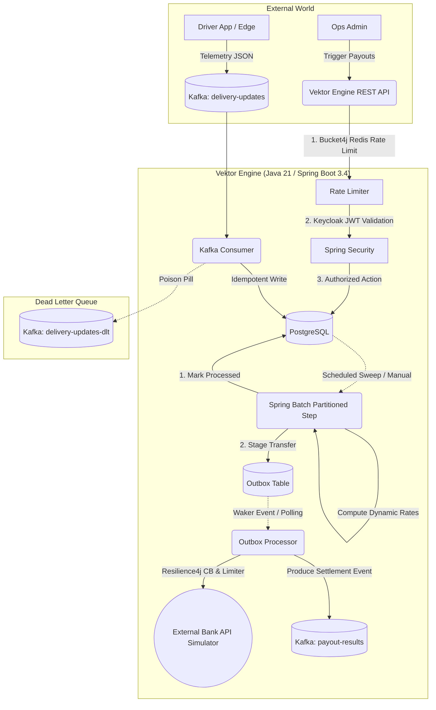

# 🚀 Vektor Dispatch & Payout Engine

A highly concurrent, fault-tolerant financial settlement engine designed for real-time logistics and gig-economy platforms.

The Vektor Engine safely ingests high-throughput delivery telemetry via Apache Kafka, computes dynamic driver payouts using partition-isolated Spring Batch processing, and dispatches funds to external banking rails with absolute, zero-data-loss consistency.

## 🏗️ Enterprise Architecture

This system implements multiple high-availability design patterns to guarantee data integrity and accurate financial settlement, even during severe network outages, Kafka broker disconnects, or JVM crashes.



## 🧠 Core Engineering Patterns & Technical Decisions

This engine was built to solve the hardest problems in distributed financial systems. Here is how it handles them:

### 1. Inbound Edge Protection (The "Embedded Edge" Pattern)
Instead of relying on an external API Gateway, Vektor implements defense-in-depth directly at the boundary layer:
- **Pre-Auth Distributed Rate Limiting**: A Bucket4j + Redis interceptor limits raw IPs before they hit the application layer, blocking DDoS attacks and spam before the CPU wastes cycles parsing cryptographic tokens.
- **Stateless OAuth2 Security**: Spring Security validates JWTs signed by an external Keycloak instance, enforcing strict Role-Based Access Control (`payout_admin` vs. `payout_read`) for all API actions.

### 2. Idempotent Data Ingestion & The Dead Letter Topic
Handling Kafka's "at-least-once" delivery semantics safely:
- **Idempotency**: The database layer uses strict unique constraints (`uq_delivery_events_event_id`) on incoming UUIDs. This silently traps and drops duplicate payloads caused by network retries without crashing the consumer.
- **Poison Pill Routing**: Corrupt payloads that fail Jackson deserialization are caught by a `DeadLetterPublishingRecoverer` utilizing a `ByteArraySerializer`. Raw, malformed bytes are seamlessly routed to a Dead Letter Topic (`delivery-updates-dlt`) for manual inspection, ensuring the main topic never blocks.

### 3. The Cutoff-Timestamp Invariant (Solving Double-Payments)
In a highly concurrent environment, a delivery event might arrive while the batch payout job is calculating totals. If a new event is accidentally marked as "PROCESSED" but wasn't included in the final payout math, the driver loses money.
- **The Fix**: Vektor passes a strict, mathematically precise `cutoff_timestamp` into the Spring Batch Job. Both the `ItemReader` and `ItemWriter` enforce `received_at <= :cutoff`, guaranteeing atomic consistency between what was calculated and what is updated.

### 4. Partitioned Batch Processing
To safely scale payout calculations, Vektor utilizes Spring Batch Partitioning.
- Drivers are hashed into deterministic "buckets" (partitions). Each bucket is processed by an isolated thread using its own database transaction (`REQUIRES_NEW`).
- **Mid-Chunk Crash Resilience**: If the JVM crashes while processing Bucket #3, Buckets #1, #2, and #4 remain successfully committed. Upon restart, Vektor instantly resumes processing only the failed Bucket #3, completely preventing split-brain transaction states.

### 5. The Transactional Outbox & Waker Pattern (Solving Dual-Writes)
When triggering a bank transfer, you cannot update your local database and make an HTTP call to the bank in the same step. If the DB commits but the HTTP call fails (or vice versa), the system falls out of sync.
- **The Fix**: Vektor uses the Transactional Outbox Pattern. The payout generation and the outbound request are staged to an outbox table in a single ACID transaction.
- **The Waker**: To achieve sub-second dispatch latency without aggressive database polling, a `@TransactionalEventListener(phase = AFTER_COMMIT)` instantly wakes the Outbox Processor thread to dispatch the API call the exact millisecond the data is safely on disk.

### 6. Outbound Resilience (Circuit Breakers & Rate Limiters)
External bank APIs are unreliable. Vektor protects its outbound TCP connections using Resilience4j:
- A Circuit Breaker detects `503 Service Unavailable` or timeouts from the bank. If failure thresholds are met, the circuit opens, failing fast to save thread resources.
- The Outbox Sweeper handles these `FAILED_SYSTEM_DOWN` statuses gracefully, continuously retrying the request using the original `Idempotency-Key` until the bank acknowledges the transaction.

## 🛠️ Technology Stack
- **Core**: Java 21, Spring Boot 3.4.1
- **Data Processing**: Spring Batch, Spring Kafka, Spring Data JPA
- **Database & Caching**: PostgreSQL 16, Redis 7 (Lettuce)
- **Security & Edge**: Spring Security (OAuth2 Resource Server), Keycloak, Bucket4j
- **Resilience**: Resilience4j (Circuit Breakers & Rate Limiters), Spring RestClient
- **Observability**: SLF4J MDC, Logstash JSON Encoder, Grafana, Loki, Promtail, Prometheus
- **Testing**: JUnit 5, Testcontainers, Awaitility

## 🚀 Getting Started

### Prerequisites
- Docker & Docker Compose
- Java 21 & Maven 3.9+ (Optional, if building locally)

### 1. Boot the Infrastructure
A single command will spin up the entire enterprise stack (PostgreSQL, Kafka, Zookeeper, Redis, Keycloak, Promtail, Grafana Loki, the Vektor Bank Simulator, and the Vektor Engine itself).

```bash
./mvnw clean package -DskipTests
docker-compose up -d --build
```

### 2. Configure Authentication (Keycloak)
1. Navigate to `http://localhost:8082` (`Admin`/`Admin`).
2. Create the `vektor-realm` and a client named `vektor-api`.
3. Create a user with the `payout_admin` role.
4. Fetch your JWT Token to interact with the API.

### 3. API Contracts
Once the engine is running, view the interactive OpenAPI (Swagger) contract at:
👉 **`http://localhost:8080/swagger-ui/index.html`**

*(For asynchronous Kafka integration schemas, see the `docs/EVENTS.md` contract).*

## 🔭 Observability (The PLG Stack)
The engine features a fully integrated observability layer. SLF4J MDC (Mapped Diagnostic Context) is configured to automatically inject `driverId` and `traceId` into all logs.

Logs are output in raw JSON and shipped to Grafana Loki via Promtail. You can query the exact lifecycle of any delivery or settlement event in Grafana (`http://localhost:3000`) using LogQL:

```logql
{app="vektor-dispatch-engine"} |= "R-101"
```

## 🧪 Automated Testing & Chaos Engineering
The integration test suite utilizes Testcontainers to spin up ephemeral Docker instances of Postgres, Redis, and Kafka to mathematically prove the fault-tolerance of the system.

```bash
./mvnw clean verify
```

### Key Proofs Verified by CI/CD:
- **`DispatchEngineFailureIT`**: Validates safe routing of Base64-decoded Poison Pills to the DLT and idempotent rejection of duplicate UUIDs.
- **`PartitionedPayoutRestartIT`**: Simulates a mid-chunk JVM crash during payout generation, verifying that the Batch job cleanly restarts and re-processes only the failed partition without double-paying completed chunks.
- **`KeycloakSecurityIT`**: Bootstraps an ephemeral Keycloak container, provisions a realm via JSON import, and mathematically guarantees unauthorized users are rejected via HTTP `401`/`403`.
